# Automatic Image Colorization

[](http://makeapullrequest.com)
[](https://www.gnu.org/licenses/gpl-3.0)
[](https://github.com/git-preet)

## Overview

This is a TensorFlow implementation of the Residual Encoder Network based on [Automatic Colorization](http://tinyclouds.org/colorize/) and the pre-trained VGG16 model from [https://github.com/machrisaa/tensorflow-vgg](https://github.com/machrisaa/tensorflow-vgg)

**For latest TensorFlow with [estimator](https://www.tensorflow.org/guide/estimators) support, check [tf-1.12](https://github.com/Armour/Automatic-Image-Colorization/tree/tf-1.12) branch. (still under development, the training code is working now)**

## Structure

* `config.py`: config variables like batch size, training_iters and so on
* `image_helper.py`: all functions related to image manipulation
* `read_input.py`: all functions related to input
* `residual_encoder.py`: the residual encoder model
* `common.py`: the common part for training and testing, which is mainly the workflow for this model
* `train.py`: train the residual encoder model using TensorFlow built-in AdamOptimizer
* `test.py`: test your own images and save the output images


## The Technical Details

This is a deep learning based model.  More specifically, what I've done is
combined the following approaches:

### [Self-Attention Generative Adversarial Network](https://arxiv.org/abs/1805.08318)

Except the generator is a **pretrained U-Net**, and I've just modified it to
have the spectral normalization and self-attention.  It's a pretty
straightforward translation.

### [Two Time-Scale Update Rule](https://arxiv.org/abs/1706.08500)

This is also very straightforward – it's just one to one generator/critic
iterations and higher critic learning rate.
This is modified to incorporate a "threshold" critic loss that makes sure that
the critic is "caught up" before moving on to generator training.
This is particularly useful for the "NoGAN" method described below.

### NoGAN

There's no paper here! This is a new type of GAN training that I've developed to
solve some key problems in the previous DeOldify model.
The gist is that you get the benefits of GAN training while spending minimal time
doing direct GAN training.
More details are in the [What is NoGAN?](#what-is-nogan) section (it's a doozy).

### Generator Loss

Loss during NoGAN learning is two parts:  One is a basic Perceptual Loss (or
Feature Loss) based on VGG16 – this just biases the generator model to replicate
the input image.
The second is the loss score from the critic.  For the curious – Perceptual Loss
isn't sufficient by itself to produce good results.
It tends to just encourage a bunch of brown/green/blue – you know, cheating to
the test, basically, which neural networks are really good at doing!
Key thing to realize here is that GANs essentially are learning the loss function
for you – which is really one big step closer to toward the ideal that we're
shooting for in machine learning.
And of course you generally get much better results when you get the machine to
learn something you were previously hand coding.
That's certainly the case here.

**Of note:**  There's no longer any "Progressive Growing of GANs" type training
going on here.  It's just not needed in lieu of the superior results obtained
by the "NoGAN" technique described above.

The beauty of this model is that it should be generally useful for all sorts of
image modification, and it should do it quite well.
What you're seeing above are the results of the colorization model, but that's
just one component in a pipeline that I'm developing with the exact same approach.

## This Project, Going Forward

So that's the gist of this project – I'm looking to make old photos and film
look reeeeaaally good with GANs, and more importantly, make the project *useful*.
In the meantime though this is going to be my baby and I'll be actively updating
and improving the code over the foreseeable future.
I'll try to make this as user-friendly as possible, but I'm sure there's going
to be hiccups along the way.

Oh and I swear I'll document the code properly...eventually.  Admittedly I'm
*one of those* people who believes in "self documenting code" (LOL).


## TensorFlow graph

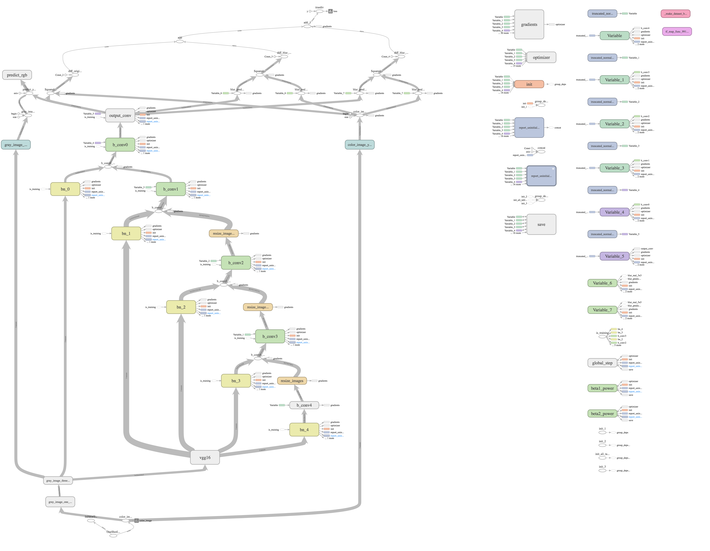

## How to use

* Download pre-trained VGG16 model [vgg16.npy](https://drive.google.com/u/0/uc?id=1d0BRPQomC40L5xClfmuUBayRdJIdqKVb&export=download&confirm=t&uuid=ffb6f7e1-d71f-4f5d-a6a5-083f0b767e54&at=AB6BwCDjgV_wW8zsEGwQE5_Oh9kz:1691880071525) to vgg folder

* Option 1: Use a pre-trained residual encoder model
  * Download model [here](https://github.com/git-preet/IMAGE_COLORIZATION)
  * Unzip all files to `summary_path` (you can change this path in `config.py`)

* Option 2: Train your own model!
  1. Change the `batch_size` and `training_iters` if you want.
  2. Change `training_dir` to your directory that has all your training jpg images
  3. Run `python train.py`

* Test
  1. Change `testing_dir` to your directory that has all your testing jpg images
  2. Run `python test.py`

## Examples

* 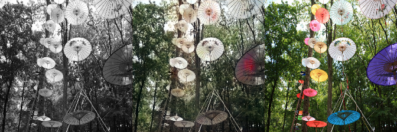
* 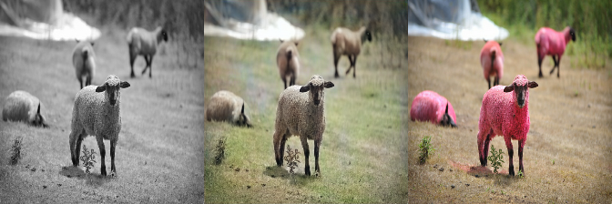
* 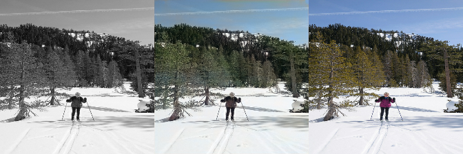
* 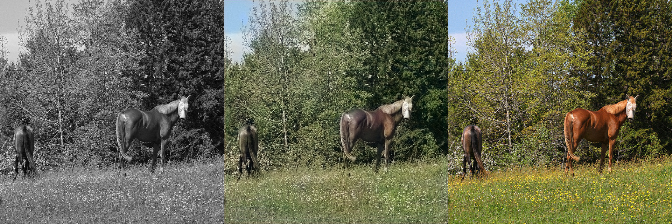
* 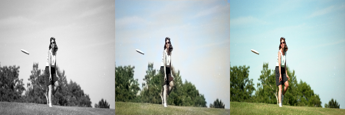
* 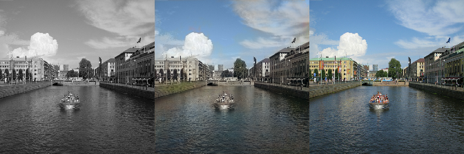
* 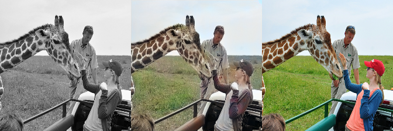
* 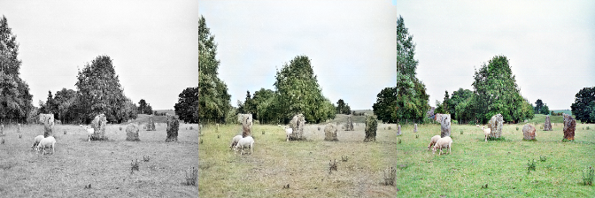
* 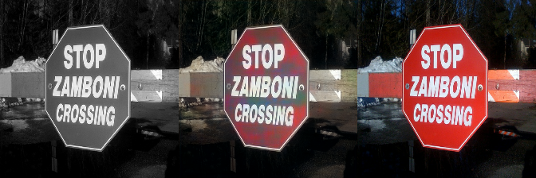
* 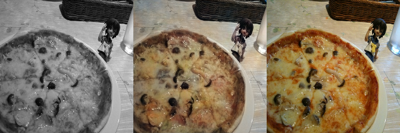
* 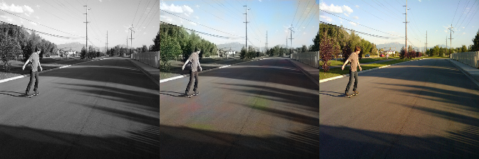


* More example output images can be found in [sample_output_images](https://github.com/git-preet/IMAGE_COLORIZATION) folder.

#### Easy Install

You should now be able to do a simple install with Anaconda. Here are the steps:

Open the command line and navigate to the root folder you wish to install.  Then
type the following commands

```console
git clone https://github.com/git-preet/IMAGE_COLORIZATION Imagee
cd Imagee
conda env create -f environment.yml
```

Then start running with these commands:

```console
source activate 
jupyter lab
```

From there you can start running the notebooks in Jupyter Lab, via the url they
provide you in the console.


## References

* [Automatic Colorization](http://tinyclouds.org/colorize/)
* [pavelgonchar/colornet](https://github.com/pavelgonchar/colornet)
* [raghavgupta0296/ColourNet](https://github.com/raghavgupta0296/ColourNet)
* [pretrained VGG16 npy file](https://github.com/machrisaa/tensorflow-vgg)


## License

[GNU GPL 3.0](https://github.com/git-preet/IMAGE_COLORIZATION/blob/main/LICENSE) for personal or research use. COMMERCIAL USE PROHIBITED.
